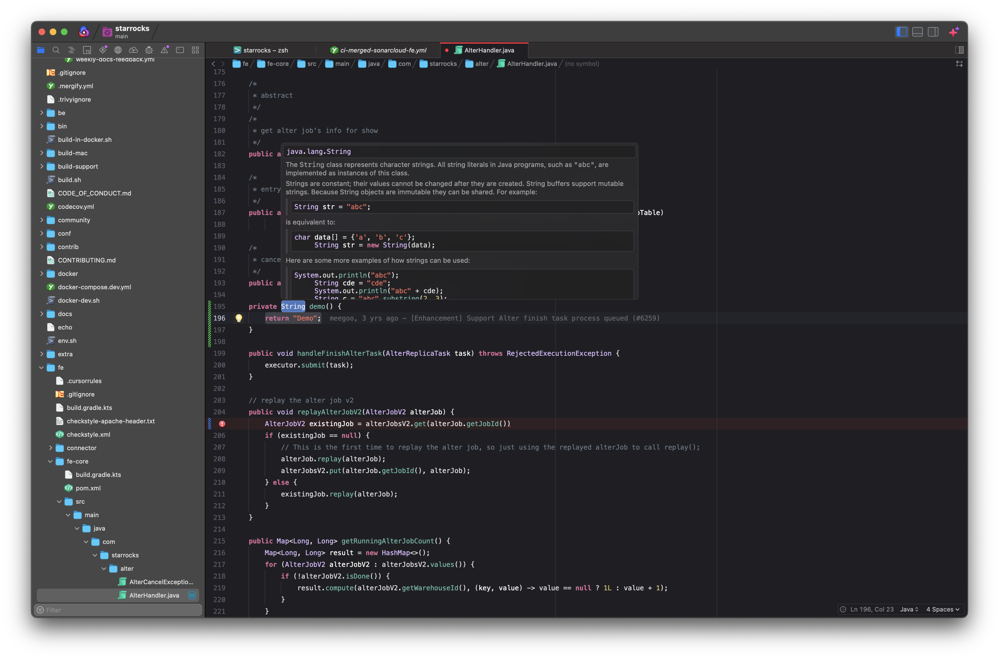

# Java Extension for Nova
A comprehensive Java development extension for Nova editor, providing rich language support through Eclipse JDT Language Server, tree-sitter syntax highlighting, and integrated linting.

## ✨ Features
- **Syntax Highlighting** - Fast, accurate syntax highlighting via tree-sitter
- **Code Intelligence** - Powered by Eclipse JDT Language Server
  - Auto-completion
  - Hover documentation
  - Signature help
- **Navigation**
  - Jump to Definition
  - Jump to Type Definition
  - Jump to Implementation
  - Find References
  - Find Symbol
- **Code Actions**
  - Format File
  - Organize Imports
  - Rename Symbol
- **Linting** - Real-time diagnostics and error checking
- **Code Folding** - Fold classes, methods, blocks, and comments
- **Symbol Outline** - Navigate your code structure



### Java Development Kit (JDK)
You need JDK 21 or later installed on your system.

**macOS:**
```bash
# Check if Java is installed
java -version

# Install via Homebrew
brew install openjdk@21
```

### Eclipse JDT Language Server

The extension requires Eclipse JDT.LS (Java Language Server).

**Installation via Homebrew (Recommended):**
```bash
brew install jdtls
```

## 🚀 Getting Started

1. **Install the Extension**
   - Open Nova
   - Go to Extensions Library
   - Search for "Java"
   - Click Install

2. **Configure JDK Path** (if not auto-detected)
   - Open Extension Preferences: `Extensions → Extension Library → Java → Preferences`
   - Set "Java JDK Home" to your JDK installation path
   - Example: `/Library/Java/JavaVirtualMachines/jdk-21.jdk/Contents/Home`

3. **Open a Java Project**
   - The extension activates automatically when you open `.java` files
   - Supports Maven (`pom.xml`) and Gradle (`build.gradle`) projects
   - For Eclipse projects, ensure `.project` file exists

## ⚙️ Configuration

### Global Settings

Access via `Extensions → Extension Library → Java → Preferences`

**Language Server:**
- Choose between automatic or custom language server
- Configure custom JDK path
- Set language server path

**Formatting:**
- Enable/disable format on save
- Choose formatter: Language Server (Eclipse JDT) or Gradle Spotless
- Choose formatting style (Google, AOSP, Eclipse, Palantir, or Custom)

**Linting:**
- Enable/disable diagnostic linting

### Workspace Settings

Access via `Project → Project Settings → Java`

Configure per-project settings:
- JDK home
- Format on save behaviour
- Formatter choice (inherit from global or override)
- Source paths
- Output path
- Referenced libraries (JAR files)

## 🎨 Formatting

The extension supports two formatting approaches:

### Language Server Formatter (Eclipse JDT)

Uses the built-in Eclipse JDT formatter with these style presets:

- **Google Java Style** - Google's Java style guide
- **AOSP** - Android Open Source Project style
- **Eclipse** - Eclipse IDE default style
- **Palantir Java Format** - Palantir's Java style
- **Custom** - Configure your own style

### Gradle Spotless Formatter

Uses Gradle Spotless with Palantir Java Format. This option:

- Runs `./gradlew spotlessApply` on format
- Requires a Gradle project with Spotless configured
- Uses your project's existing Spotless configuration
- Modifies files on disk (you'll need to reload after formatting)

**To use Spotless:**
1. Ensure your project has `build.gradle` with Spotless configured
2. Set formatter to "Gradle Spotless (Palantir)" in preferences
3. Format will run `./gradlew spotlessApply` automatically

**Example Spotless configuration in `build.gradle`:**
```gradle
plugins {
    id 'com.diffplug.spotless' version '6.x.x'
}

spotless {
    java {
        palantirJavaFormat()
    }
}
```

## 🔧 Commands

All commands are available in the Editor menu when editing Java files:

- **Jump To Definition** - Navigate to symbol definition
- **Jump To Type Definition** - Navigate to type definition
- **Jump To Implementation** - Navigate to implementation
- **Find References** - Find all references to a symbol
- **Find Symbol** - Search for symbols in workspace
- **Format File** - Format current file (⌥⇧F)
- **Organize Imports** - Organize and optimize imports
- **Rename Symbol** - Rename symbol across workspace
- **Restart Language Server** - Restart the Java language server


## Acknowledgements
- This repo is heavily inspired (originally forked from) the nova-gobee extension. 

---

**Enjoy coding in Java with Nova!** ☕️
